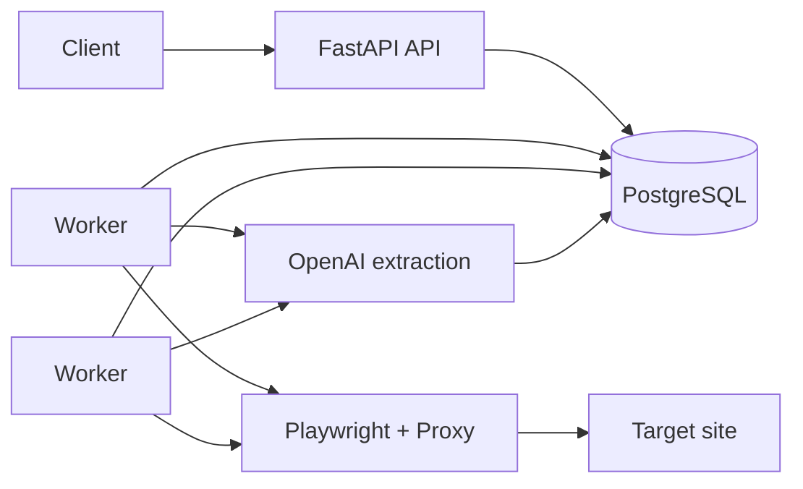

# Architecture

The platform is split into three operational pieces:

- FastAPI control plane
- PostgreSQL durable queue and state store
- Playwright worker fleet

## Request lifecycle

1. A client submits a scrape job through the API.
2. The API stores the job in PostgreSQL with status `queued`.
3. One worker claims the job using row-level locking.
4. The worker picks a proxy, launches a Playwright context, and renders the page.
5. The worker extracts cleaned text, source metadata, and optional source-specific fields.
6. The AI layer converts the page snapshot into structured JSON.
7. The worker persists the result and marks the job `succeeded` or `failed`.

## Why PostgreSQL for the queue

Using PostgreSQL removes the need for a separate broker. We get:

- durable queue state
- transparent retry bookkeeping
- simple operations
- easy inspection with SQL

## Why Playwright

Playwright gives us real browser rendering, JavaScript execution, and per-job proxy contexts. That makes the platform work on pages that are not reliably scrapeable with plain HTTP requests.

